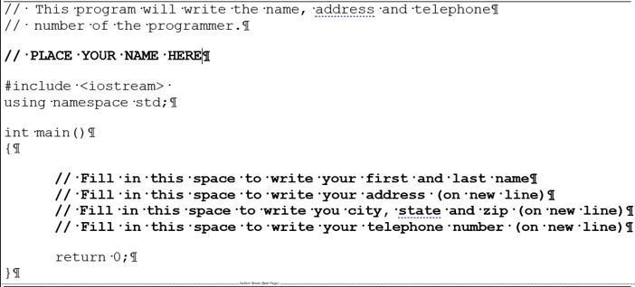
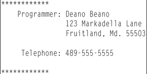
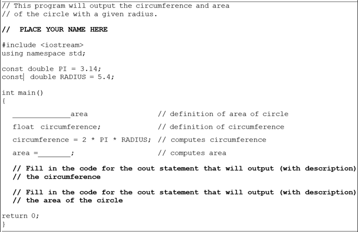
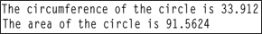
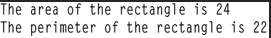
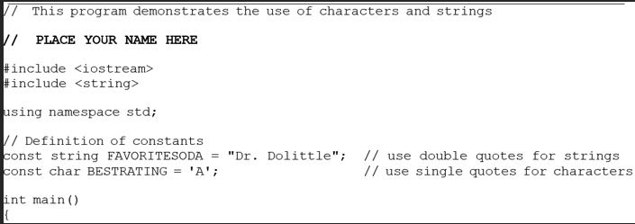
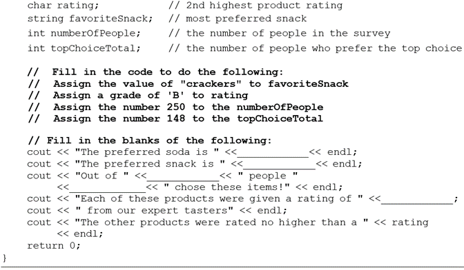

# C++ For Science - Lab 2

This template repository is the starter project for C++ For Science Lab 2. Written in C++.

### Question(s)

1. **Working with the cout Statement**

1.1. Retrieve program name.cpp from the Lab 2 folder. Fill in the code so that the program will do the following:

``` 
- Write your first and last name on one line.
- Write your address on the next line (recall the function of the endl statement). 
- Write your  city, state and zip on the next line.
- Write your telephone number on the next line.
```

Remember that to output a literal, such as “Hello”, you must use quotes. Compile and run the program.  

Example:  

```
Deano Beano
123 Markadella Lane
Fruitland, Md. 55503
489-555-5555
```

The code for name.cpp is as follows:  

  


1.2. Change the program so that three blank lines separate the telephone number from the address. Compile and run the program.  

1.3. Change the program so that the following (but with your name and address) is printed. Try to get the spacing just like the example. Compile and run the program.  

  


2. **Working with Constants, Variables and Arithmetic Operators**

2.1. Bring in the file circlearea.cpp from the Lab 2 folder.

The code of circlearea.cpp is as follows:

  

2.2. Fill in the blanks and the cout statements so that the output will produce the following:

  

2.3. Change the data type of circumference from float to int. Run the program and record the results.  

```
The circumference of the circle is		.
The area of the circle is	.
```
Explain what happened to get the above results.  

3. **Rectangle Area and Perimeter**

3.1. Using Lab 2.2 as an example, develop a program that will determine the area and perimeter of a rectangle. The length and width can be given as constants. (LENGTH=8 WIDTH=3)  

3.2. Compile and run your program. Continue to work on it until you get the following output:

  

4. **Working with Characters and Strings**

4.1. Retrieve program stringchar.cpp from the Lab 2 folder. This program illustrates the use of characters and strings. The char data type allows only one character to be stored in its memory location. The string data type (a class and not a true data type built into the language) allows a sequence of characters to be stored in one memory location.  

The code of stringchar.cpp is as follows:  

  

  